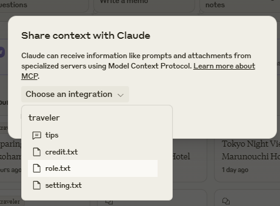

# @mfukushim/map-traveler-mcp

[Japanese](./README_jp.md)

This is an MCP server that creates an environment for an avatar to virtually travel on Google Maps.

From an MCP client such as Claude Desktop, you can give instructions to the avatar and report on the progress of its journey with photos.


## 設定

You will need to obtain and set access keys for multiple APIs, such as for accessing multiple Google maps and generating images.
Use of the API may incur charges.

#### Settings for using with Claude Desktop  
claude_desktop_config.json
```json
{
  "mcpServers": {
    "traveler": {
      "command": "npx",
      "args": ["-y", "@mfukushim/map-traveler-mcp"],
      "env":{
      	  	"GoogleMapApi_key":"(Google Map APIのキー)",
            "pixAi_key":"(pixAi APIのキー)",
			"sd_key":"(またはStability.aiのAPIのキー",
			"sqlite_path":"(db保存ファイルのパス 例 %USERPROFILE%/Desktop/traveler.sqlite など)",
			"bs_id":"(bluesky snsの登録アドレス)",
			"bs_pass":"(bluesky snsのパスワード)",
			"bs_handle":"(bluesky snsのハンドル名 例 geo-less-traveler.bsky.social など)"
      }
    }
  }
}
```
Please set the following three Credentials for Google Map API.  
- Street View Static API
- Places API (New)
- Time Zone API

https://developers.google.com/maps/documentation/streetview/get-api-key

If you use an image generation AI, set either pixAI's pixAi_key or Stability.ai's sd_key.  

https://platform.pixai.art/docs
https://platform.stability.ai/docs/api-reference#tag/SDXL-1.0-and-SD1.6/operation/textToImage

The bluesky SNS address/password is optional. Since it will be automatically posted, we recommend you to create a dedicated account.  

You can also run it in practice mode, which does not require an API key for verification.

Practice mode settings  
claude_desktop_config.json
```json
{
  "mcpServers": {
    "traveler": {
      "command": "npx",
      "args": ["-y", "@mfukushim/map-traveler-mcp"]
    }
  }
}
```

## How to use

1. Prepare to use Claude Desktop.

2. Reflect one of the above settings in claude_desktop_config.json.

3. Restart Claude Desktop. It may take some time to configure. Check that the following mark appears in the bottom right of the screen.


4. Ask "Where are you now?" and "Go on a journey." A conversation will begin. When using the API, a confirmation screen will appear, so select Allow.


5. Select Attach from MCP and select role.txt.




6. A travel prompt has been incorporated, so feel free to talk to it.
