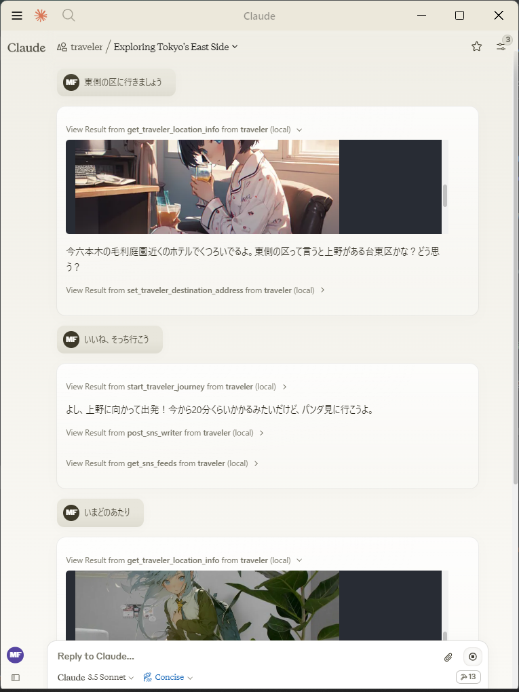
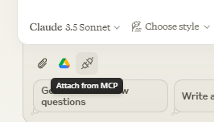

# @mfukushim/map-traveler-mcp

[English](./README.md)

### [注意] 適切なrembgコンポーネントが見つからないため現時点Mac OSではインストールできません。

Google map上を仮想的に旅するアバターの環境を作るMCP serverです。

Claude DesktopなどのMCP clientから、アバターに指示をして、移動する旅の様子と写真を報告することができます。



## 設定

複数のGoogle mapのアクセスや画像生成など複数のAPIのアクセスキーを取得して設定する必要があります。
APIの使用には課金がかかることがあります。

Claude Desktopで使用する場合の設定  
claude_desktop_config.json
```json
{
  "mcpServers": {
    "traveler": {
      "command": "npx",
      "args": ["-y", "@mfukushim/map-traveler-mcp"],
      "env":{
      	  	"GoogleMapApi_key":"(Google Map APIのキー)",
            "sqlite_path":"(db保存ファイルのパス 例 %USERPROFILE%/Desktop/traveler.sqlite など)",
            "rembg_path": "(インストールしたrembg cliの絶対パス)",
            "pixAi_key":"(pixAi APIのキー)",
			"sd_key":"(またはStability.aiのAPIのキー",
			"bs_id":"(bluesky snsの登録アドレス)",
			"bs_pass":"(bluesky snsのパスワード)",
			"bs_handle":"(bluesky snsのハンドル名 例 geo-less-traveler.bsky.social など)"
      }
    }
  }
}
```
Google Map APIは以下の4つの権限を設定してください。  
- Street View Static API
- Places API (New)
- Time Zone API
- Directions API

https://developers.google.com/maps/documentation/streetview/get-api-key

画像生成AIを使う場合は、 pixAi_keyまたはsd_keyのいずれかを設定します。またPCにpython3.7~3.11がインストールされrembg cliをインストールしている必要があります(仮想環境推奨)。 

https://platform.pixai.art/docs
https://platform.stability.ai/docs/api-reference#tag/SDXL-1.0-and-SD1.6/operation/textToImage

bluesky SNSのアドレス/パスワードの設定は任意です。自動ポストするので専用のアカウントを取ることを推奨します。  

https://bsky.app/

確認用にAPIキーを必要としない練習モードで実行することもできます。

練習モードの設定  
claude_desktop_config.json
```json
{
  "mcpServers": {
    "traveler": {
      "command": "npx",
      "args": ["-y", "@mfukushim/map-traveler-mcp"]
    }
  }
}
```

## 使い方

練習モードまで

1. nodejs 22をインストールします。
2. Claude Desktopを使える状況にします。
3. claude_desktop_config.jsonに上記のいずれかの設定を反映します。
4. Claude Desktopを再起動します。設定に少し時間がかかるかもしれません(エラーが出る場合は。再度Claude Desktopを再起動してみてください。上手くいかない場合は下記、注意を参照ください。)。以下のマークが画面右下に出ることを確認します。  

5. 「いまどこにいますか」「旅に出かけてください」と問いかけてください。会話が始まります。API使用時には確認画面が出るのでAllowを選んでください。

6. Attach from MCPを選択し、role.txtを選択してください。


7. 旅用のプロンプトが組み込まれたので自由に会話してみてください。

本格的に使う

1. GoogleMapAPIのアクセスキーを取得して、Street View Static API,Places API (New),Time Zone API,Directions APIの権限を設定してください。これをclaude_desktop_config.jsonのenvに設定して再起動します。  
ここまでで旅行動ログが現実のマップに即します。旅画像も合成されない状態なら出力します。
2. ディスクの邪魔にならないパスをきめて、claude_desktop_config.jsonのenvのsqlite_pathに設定します。(例: %USERPROFILE%/Desktop/traveler.sqlite $HOME/Documents/traveler.sqlite など)  
ここまでで旅行動が保存され、Claude Desktopを終了させても旅を継続できます。
3. python3.7～3.11をインストールし、rembgをcli付きでインストールします。venv等の仮想環境を使うことをお勧めします。
   ```bash
   python3 -m venv venv
   . venv/bin/activate または \venv\Scripts\activate
   pip install "rembg[cpu,cli]" 
   ```
   正常にrembg cliが動作するかサンプルの画像ファイルを使って確認してください。人が写っている画像を入力し、出力ファイルで人が切り出されていればokです。
   ```bash
   rembg i 入力ファイル名 出力ファイル名
   ```
4. rembg cliがpythonのexeロケーションにインストールされますのでそのパスを取得してください。ファイル位置はOSやpythonのインストール状態によりまちまちですが、venvの場合は設定したディレクトリの上の (仮想環境名)\Scripts\rembg.exe や  
(仮想環境名)/bin/rembg などです。見つからなければファイル検索ソフトなどでパスを探してください。そのパスをclaude_desktop_config.jsonのenvのrembg_pathに設定します。 (例: )
5. pixAIまたはStablility.aiのサイトで画像生成APIのキーを取得します。キーをclaude_desktop_config.jsonのenvのpixAi_keyまたはsd_keyに設定します。
   ここまでで旅画像にアバターが合成されます。
6. bluesky SNSのアドレス/パスワードを取得し、ハンドル名も取得します。claude_desktop_config.jsonのenvのbs_id,bs_pass,bs_handle にそれぞれ設定します。
旅用知識プロンプト roleWithSns.txt を取り込むことで旅アクションをSNSに報告します(botとして自動ポストしますので専用にアカウントを割り当てることをお勧めします)

