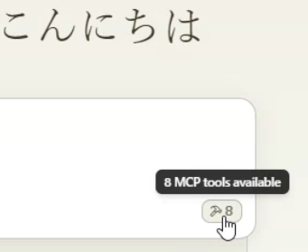

# @mfukushim/map-traveler-mcp

[English](./README.md)

Google map上を仮想的に旅するアバターの環境を作るMCP serverです。

Claude DesktopなどのMCP clientから、アバターに指示をして、移動する旅の様子と写真を報告することができます。


## 設定

複数のGoogle mapのアクセスや画像生成など複数のAPIのアクセスキーを取得して設定する必要があります。
APIの使用には課金がかかることがあります。

Claude Desktopで使用する場合の設定  
claude_desktop_config.json
```json
{
  "mcpServers": {
    "traveler": {
      "command": "npx",
      "args": ["-y", "@mfukushim/map-traveler-mcp"],
      "env":{
      	  	"GoogleMapApi_key":"(Google Map APIのキー)",
            "pixAi_key":"(pixAi APIのキー)",
			"sd_key":"(またはStability.aiのAPIのキー",
			"sqlite_path":"(db保存ファイルのパス 例 %USERPROFILE%/Desktop/traveler.sqlite など)",
			"bs_id":"(bluesky snsの登録アドレス)",
			"bs_pass":"(bluesky snsのパスワード)",
			"bs_handle":"(bluesky snsのハンドル名 例 geo-less-traveler.bsky.social など)"
      }
    }
  }
}
```
Google Map APIは以下の3つの権限を設定してください。  
- Street View Static API
- Places API (New)
- Time Zone API


画像生成AIを使う場合は、 pixAi_keyまたはsd_keyのいずれかを設定します。またPCにpythonがインストールされている必要があります。 

bluesky SNSのアドレス/パスワード は任意です。自動ポストするので専用のアカウントを取ることを推奨します。  

確認用にAPIキーを必要としない練習モードで実行することもできます。

練習モードの設定  
claude_desktop_config.json
```json
{
  "mcpServers": {
    "traveler": {
      "command": "npx",
      "args": ["-y", "@mfukushim/map-traveler-mcp"]
    }
  }
}
```

## 使い方

1. Claude Desktopを使える状況にします。
2. claude_desktop_config.jsonに上記のいずれかの設定を反映します。
3. Claude Desktopを再起動します。設定に少し時間がかかるかもしれません。以下のマークが画面右下に出ることを確認します。  

4. 「いまどこにいますか」「旅に出かけてください」と問いかけてください。会話が始まります。API使用時には確認画面が出るのでAllowを選んでください。

5. Attach from MCPを選択し、role.txtを選択してください。


6. 旅用のプロンプトが組み込まれたので自由に会話してみてください。
